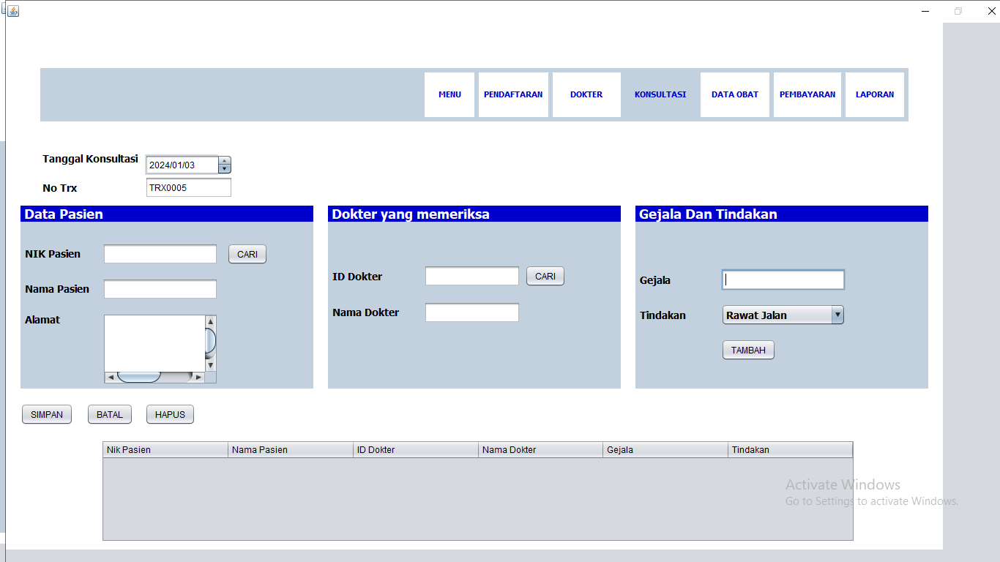
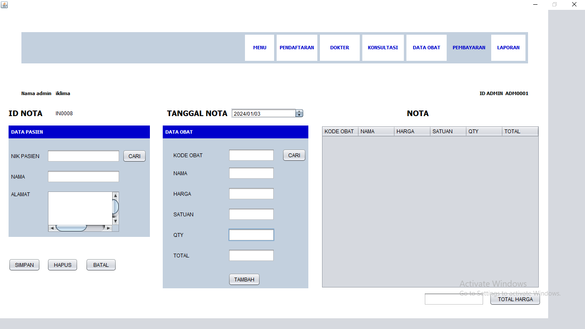
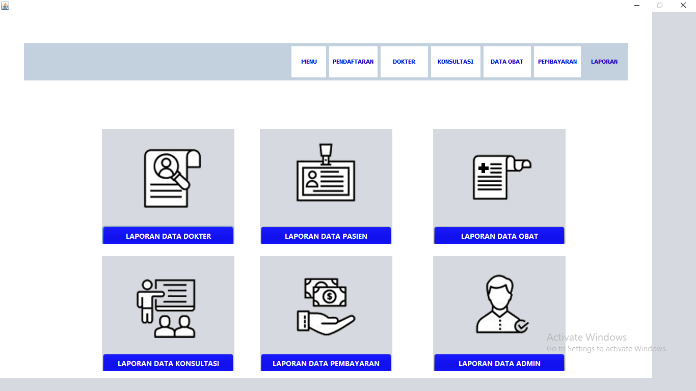

# Aplikasi-Sistem-Pelayanan-Kesehatan

# Gambar Project 

DATABASE

# Deskripsi Aplikasi
Aplikasi Sistem Pelayanan Kesehatan adalah solusi inovatif yang dirancang untuk meningkatkan efisiensi dan aksesibilitas layanan kesehatan. Dengan fokus utama pada memberikan pelayanan yang lebih cepat, mudah, dan terkoordinasi, aplikasi ini menyajikan serangkaian fitur yang mempermudah interaksi antara pasien, tenaga kesehatan, dan penyedia layanan medis.

